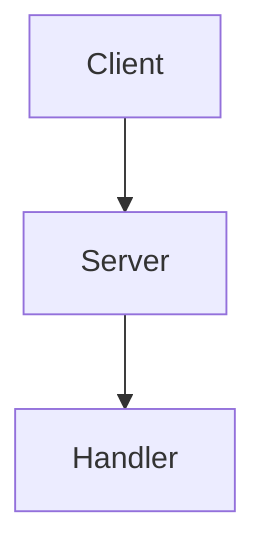

# Building and Viewing Hypern Documentation

This guide explains how to build and view the Hypern documentation locally using MkDocs.

## Prerequisites

Before building the documentation, ensure you have:

- Python 3.11 or higher
- Poetry package manager
- Git (for cloning the repository)

## Quick Start

### 1. Install Documentation Dependencies

```bash
poetry install --with docs
```

### 2. Serve Documentation Locally

To view the documentation with live reload:

```bash
mkdocs serve
```

Then open your browser to: `http://127.0.0.1:8000`

The documentation will automatically reload when you make changes to any `.md` files.

### 3. Build Static Documentation

To build the documentation as static HTML:

```bash
mkdocs build
```

This creates a `site/` directory containing the generated documentation.

## Documentation Structure

```
Hypern-clone/
├── mkdocs.yml              # MkDocs configuration
├── pyproject.toml          # Poetry dependencies (includes docs group)
├── docs/                   # Documentation source files
│   ├── index.md           # Home page
│   ├── getting-started/   # Getting started guides
│   ├── guide/             # User guides
│   ├── advanced/          # Advanced topics
│   ├── api/               # API reference
│   ├── architecture/      # Architecture documentation
│   ├── examples/          # Code examples
│   ├── contributing/      # Contributing guides
│   └── changelog.md       # Version history
└── site/                  # Generated documentation (after build)
```

## Common Commands

### Serve Documentation

```bash
# Serve on default port (8000)
mkdocs serve

# Serve on custom port
mkdocs serve -a localhost:8080

# Serve with verbose output
mkdocs serve --verbose
```

### Build Documentation

```bash
# Build documentation
mkdocs build

# Build with strict mode (fail on warnings)
mkdocs build --strict

# Clean build (remove existing site directory)
mkdocs build --clean
```

### Deploy Documentation

```bash
# Deploy to GitHub Pages
mkdocs gh-deploy

# Deploy with custom commit message
mkdocs gh-deploy -m "Update documentation"
```

## Writing Documentation

### File Format

- All documentation files are written in Markdown (`.md`)
- Files are located in the `docs/` directory
- Navigation structure is defined in `mkdocs.yml`

### Adding a New Page

1. Create a new `.md` file in the appropriate directory:
   ```bash
   touch docs/guide/new-feature.md
   ```

2. Add content to the file using Markdown

3. Add the page to navigation in `mkdocs.yml`:
   ```yaml
   nav:
     - User Guide:
         - New Feature: guide/new-feature.md
   ```

4. Preview your changes:
   ```bash
   mkdocs serve
   ```

### Markdown Features

The documentation supports these Markdown extensions:

#### Code Blocks

```python
from hypern import Hypern

app = Hypern()
```

#### Admonitions

```markdown
!!! note
    This is a note

!!! warning
    This is a warning

!!! tip
    This is a helpful tip
```

#### Tables

```markdown
| Column 1 | Column 2 |
|----------|----------|
| Value 1  | Value 2  |
```

#### Tabs

```markdown
=== "Python"
    ```python
    print("Hello")
    ```

=== "JavaScript"
    ```javascript
    console.log("Hello");
    ```
```

#### Diagrams (Mermaid)

````markdown

````

## Configuration

### Theme Customization

Edit `mkdocs.yml` to customize the theme:

```yaml
theme:
  name: material
  palette:
    - scheme: default
      primary: indigo
      accent: indigo
```

### Adding Plugins

Add plugins in `mkdocs.yml`:

```yaml
plugins:
  - search
  - mkdocstrings
```

### Custom CSS

Add custom styles in `docs/stylesheets/extra.css` and reference in `mkdocs.yml`:

```yaml
extra_css:
  - stylesheets/extra.css
```

## Troubleshooting

### Port Already in Use

If port 8000 is already in use:

```bash
mkdocs serve -a localhost:8001
```

### Build Warnings

To see detailed warnings:

```bash
mkdocs build --strict --verbose
```

### Links Not Working

- Use relative paths for internal links
- Example: `[Link](../guide/routing.md)`
- Check that all referenced files exist

### Live Reload Not Working

- Ensure you're editing files in the `docs/` directory
- Check terminal for any error messages
- Try stopping and restarting `mkdocs serve`

### Module Not Found

If you get module not found errors:

```bash
poetry install --with docs
```

## Documentation Standards

### Style Guide

1. **Clear and Concise**: Write in plain language
2. **Code Examples**: Include working, tested examples
3. **Structure**: Use headers to organize content
4. **Links**: Link to related pages
5. **Consistency**: Follow existing documentation patterns

### Before Submitting

- [ ] Test all code examples
- [ ] Check spelling and grammar
- [ ] Verify all links work
- [ ] Run `mkdocs build` successfully
- [ ] Preview with `mkdocs serve`

## Resources

- [MkDocs Documentation](https://www.mkdocs.org/)
- [Material for MkDocs](https://squidfunk.github.io/mkdocs-material/)
- [PyMdown Extensions](https://facelessuser.github.io/pymdown-extensions/)
- [MkDocstrings](https://mkdocstrings.github.io/)

## Getting Help

If you encounter issues:

1. Check this guide
2. Review [MkDocs documentation](https://www.mkdocs.org/)
3. Check [GitHub Issues](https://github.com/DVNghiem/hypern/issues)
4. Ask in GitHub Discussions

## Contributing

To contribute to documentation:

1. Fork the repository
2. Create a branch: `git checkout -b docs/your-change`
3. Make your changes
4. Test locally: `mkdocs serve`
5. Commit: `git commit -m "docs: describe your changes"`
6. Push: `git push origin docs/your-change`
7. Create a Pull Request

See [Contributing Guidelines](docs/contributing/guidelines.md) for more details.

---

**Happy documenting!** 📚✨
