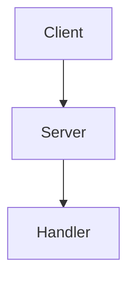

# Documentation Quick Start Guide

Welcome! This guide will get you up and running with the Hypern documentation in under 5 minutes.

## 🚀 Quick Start (3 Steps)

### Step 1: Install Dependencies

```bash
pip install -r requirements-docs.txt
```

Or install manually:

```bash
pip install mkdocs mkdocs-material mkdocstrings[python] pymdown-extensions
```

### Step 2: Serve Documentation

```bash
mkdocs serve
```

### Step 3: View in Browser

Open your browser to: **http://127.0.0.1:8000**

That's it! The documentation is now running with live reload. Any changes you make to `.md` files will automatically refresh in your browser.

---

## 📖 What's Included

The documentation covers:

✅ **Getting Started** - Installation, quick start, concepts  
✅ **User Guides** - Application, routing, requests, responses  
✅ **API Reference** - Complete API documentation  
✅ **Advanced Topics** - Performance, WebSockets, deployment  
✅ **Examples** - Real-world code examples  
✅ **Contributing** - Guidelines for contributors  

## 📁 Documentation Structure

```
docs/
├── index.md              # Home page
├── getting-started/      # Installation & tutorials
├── guide/                # User guides
├── api/                  # API reference
├── advanced/             # Advanced topics
├── examples/             # Code examples
└── contributing/         # Contribution guides
```

## 🛠️ Common Commands

```bash
# Serve with live reload
mkdocs serve

# Build static site
mkdocs build

# Serve on different port
mkdocs serve -a localhost:8080

# Deploy to GitHub Pages
mkdocs gh-deploy
```

## ✏️ Making Changes

1. Edit any `.md` file in the `docs/` directory
2. Save your changes
3. Browser automatically refreshes
4. No build step needed for preview!

## 📝 Adding New Pages

1. Create a new `.md` file:
   ```bash
   touch docs/guide/new-page.md
   ```

2. Add content using Markdown

3. Register in `mkdocs.yml`:
   ```yaml
   nav:
     - User Guide:
         - New Page: guide/new-page.md
   ```

4. Preview: `mkdocs serve`

## 🎨 Markdown Features

### Code Blocks

```python
from hypern import Hypern

app = Hypern()

@app.get("/")
def home(request, response):
    response.status(200)
    response.body_str("Hello!")
    response.finish()
```

### Admonitions

```markdown
!!! note
    This is a note

!!! tip
    This is a helpful tip

!!! warning
    This is a warning
```

### Tables

```markdown
| Feature | Supported |
|---------|-----------|
| REST API | ✅ |
| WebSocket | ✅ |
```

### Diagrams

```markdown

```

## 🔍 Finding Documentation Files

| Topic | Location |
|-------|----------|
| Installation | `docs/getting-started/installation.md` |
| Quick Start | `docs/getting-started/quickstart.md` |
| Application | `docs/guide/application.md` |
| Routing | `docs/guide/routing.md` |
| API Reference | `docs/api/core/hypern.md` |
| Contributing | `docs/contributing/guidelines.md` |

## 📦 Build for Production

```bash
# Build static HTML
mkdocs build

# Output in site/ directory
ls site/

# Deploy to web server
# Simply copy site/ contents to your server
```

## 🐛 Troubleshooting

### Port Already in Use

```bash
mkdocs serve -a localhost:8001
```

### Module Not Found

```bash
pip install -r requirements-docs.txt
```

### Changes Not Showing

1. Stop the server (Ctrl+C)
2. Clear browser cache
3. Restart: `mkdocs serve`

### Build Errors

```bash
# Check for errors with strict mode
mkdocs build --strict --verbose
```

## 📚 Documentation Files Completed

✅ **Home page** - Project overview  
✅ **Installation guide** - Setup instructions  
✅ **Quick start** - First application tutorial  
✅ **Concepts** - Core concepts explained  
✅ **Project structure** - Organization guide  
✅ **Application guide** - Detailed app documentation  
✅ **Routing guide** - Complete routing documentation  
✅ **API reference** - Hypern class reference  
✅ **Contributing** - Contribution guidelines  
✅ **Changelog** - Version history  

## 📋 Documentation TODO

Future pages to create (placeholders exist):

- Request handling guide
- Response building guide
- Middleware guide
- Configuration guide
- Error handling guide
- Performance optimization
- WebSocket support
- Database integration
- Testing guide
- Deployment guide
- More API references
- More examples

## 🎯 Next Steps

1. **Explore** the documentation at http://127.0.0.1:8000
2. **Read** the completed guides in `docs/`
3. **Contribute** by creating missing pages
4. **Improve** existing documentation
5. **Share** feedback and suggestions

## 📖 Resources

- **MkDocs**: https://www.mkdocs.org/
- **Material Theme**: https://squidfunk.github.io/mkdocs-material/
- **Markdown Guide**: https://www.markdownguide.org/
- **Full Build Guide**: See `DOCS_BUILD.md`
- **Documentation Summary**: See `DOCUMENTATION_SUMMARY.md`

## 🤝 Contributing to Docs

1. Fork the repository
2. Create a branch: `git checkout -b docs/improve-guide`
3. Make your changes
4. Test: `mkdocs serve`
5. Commit: `git commit -m "docs: improve installation guide"`
6. Push and create a Pull Request

## 💡 Tips

- Use `mkdocs serve` while writing (live reload is amazing!)
- Test all code examples before committing
- Check links with `mkdocs build --strict`
- Follow the style of existing docs
- Add cross-references to related pages
- Include practical examples
- Keep paragraphs short and clear

## ✨ Features

The documentation system includes:

- 🎨 Beautiful Material theme
- 🌓 Dark/light mode toggle
- 🔍 Full-text search
- 📱 Mobile responsive
- 🎯 Code syntax highlighting
- 📊 Mermaid diagrams
- 🔗 Auto-generated navigation
- 🚀 Fast build times
- 📖 API documentation support
- ✅ Live reload

## 🎉 You're Ready!

You now have everything you need to:

- View the documentation
- Make changes
- Add new pages
- Build for production
- Contribute improvements

**Happy documenting!** 📚✨

---

**Questions?** Check `DOCS_BUILD.md` for detailed instructions or `docs/README.md` for more information.

**Need help?** Open an issue or check the MkDocs documentation.