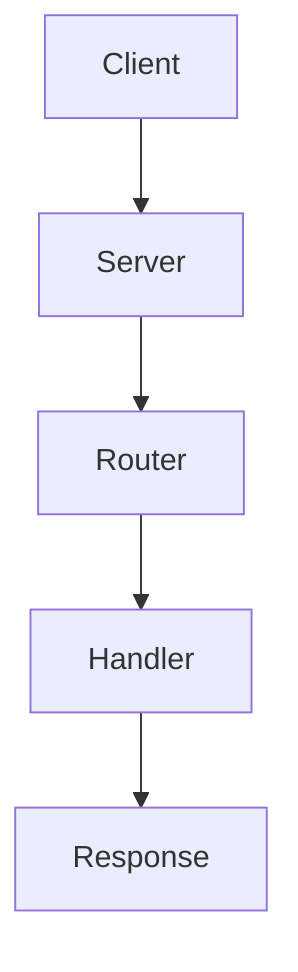

# Hypern Documentation

This directory contains the complete documentation for Hypern, built with [MkDocs](https://www.mkdocs.org/) and the [Material theme](https://squidfunk.github.io/mkdocs-material/).

## 📚 Documentation Structure

```
docs/
├── index.md                          # Home page
├── getting-started/                  # Getting Started guides
│   ├── installation.md              # Installation instructions
│   ├── quickstart.md                # Quick start tutorial
│   ├── concepts.md                  # Basic concepts
│   └── project-structure.md         # Project organization
├── guide/                           # User guides
│   ├── application.md               # Application guide
│   ├── routing.md                   # Routing guide
│   ├── requests.md                  # Request handling
│   ├── responses.md                 # Response building
│   ├── middleware.md                # Middleware guide
│   ├── configuration.md             # Configuration guide
│   └── error-handling.md            # Error handling
├── advanced/                        # Advanced topics
│   ├── performance.md               # Performance optimization
│   ├── websockets.md                # WebSocket support
│   ├── background-tasks.md          # Background tasks
│   ├── file-upload.md               # File upload handling
│   ├── database.md                  # Database integration
│   ├── testing.md                   # Testing strategies
│   └── deployment.md                # Deployment guide
├── api/                             # API Reference
│   ├── core/                        # Core APIs
│   ├── http/                        # HTTP APIs
│   └── middleware/                  # Middleware APIs
├── architecture/                    # Architecture documentation
│   ├── overview.md                  # System overview
│   ├── rust-core.md                 # Rust core details
│   ├── python-integration.md        # Python integration
│   └── performance.md               # Performance model
├── examples/                        # Code examples
│   ├── basic-api.md                 # Basic API examples
│   ├── rest-api.md                  # REST API example
│   ├── websocket.md                 # WebSocket examples
│   └── file-upload.md               # File upload examples
├── contributing/                    # Contributing guides
│   ├── guidelines.md                # Contribution guidelines
│   ├── development.md               # Development setup
│   └── code-of-conduct.md           # Code of Conduct
└── changelog.md                     # Version history
```

## 🚀 Building Documentation

### Prerequisites

Install required packages:

```bash
pip install mkdocs mkdocs-material mkdocstrings[python] pymdown-extensions
```

Or install from the project's requirements:

```bash
pip install -r requirements-docs.txt  # If available
```

### Serve Locally

To preview documentation locally with live reload:

```bash
mkdocs serve
```

Then open your browser to `http://127.0.0.1:8000`

### Build Static Site

To build the documentation as a static site:

```bash
mkdocs build
```

This creates a `site/` directory with the generated HTML.

### Deploy to GitHub Pages

To deploy documentation to GitHub Pages:

```bash
mkdocs gh-deploy
```

## ✍️ Writing Documentation

### Style Guide

1. **Use clear, concise language**
   - Write in second person (you/your)
   - Use active voice
   - Keep paragraphs short

2. **Code examples**
   - Include complete, runnable examples
   - Add comments for clarity
   - Test all code samples

3. **Structure**
   - Use headers to organize content
   - Include table of contents for long pages
   - Link to related pages

4. **Formatting**
   - Use code blocks with language specification
   - Use admonitions for notes/warnings
   - Include diagrams where helpful

### Markdown Extensions

The documentation supports these extensions:

- **Code highlighting**: Syntax highlighting for many languages
- **Admonitions**: Note, warning, tip boxes
- **Tables**: Markdown tables
- **Tabs**: Tabbed content blocks
- **Mermaid**: Diagram rendering
- **Icons & Emojis**: Material icons and emojis

### Example Admonitions

```markdown
!!! note
    This is a note

!!! warning
    This is a warning

!!! tip
    This is a helpful tip

!!! danger
    This is a danger warning
```

### Example Code Block

````markdown
```python
from hypern import Hypern

app = Hypern()

@app.get("/hello")
def hello(request, response):
    response.status(200)
    response.body_str("Hello, World!")
    response.finish()
```
````

### Example Mermaid Diagram

````markdown

````

## 📝 Contributing to Documentation

### Adding New Pages

1. Create a new `.md` file in the appropriate directory
2. Add the page to `mkdocs.yml` navigation
3. Write clear, helpful content
4. Test locally with `mkdocs serve`
5. Submit a pull request

### Updating Existing Pages

1. Find the relevant `.md` file
2. Make your changes
3. Test locally
4. Submit a pull request

### Documentation Standards

- **Accuracy**: Ensure all information is correct
- **Completeness**: Cover all relevant aspects
- **Clarity**: Write for users of all skill levels
- **Currency**: Keep documentation up to date

## 🔍 Documentation Checklist

Before submitting documentation changes:

- [ ] Content is accurate and tested
- [ ] Code examples work correctly
- [ ] Links are valid and working
- [ ] Spelling and grammar checked
- [ ] Follows style guide
- [ ] Builds without errors (`mkdocs build`)
- [ ] Renders correctly (`mkdocs serve`)

## 🛠 MkDocs Configuration

Configuration is in `mkdocs.yml` at the project root. Key settings:

- **Theme**: Material for MkDocs
- **Extensions**: Code highlighting, admonitions, etc.
- **Navigation**: Site structure and menu
- **Plugins**: Search, mkdocstrings

## 📖 Documentation Philosophy

Good documentation should:

1. **Help users succeed** - Focus on practical, actionable content
2. **Be discoverable** - Good navigation and search
3. **Be maintainable** - Clear structure and style
4. **Grow with the project** - Updated with new features
5. **Welcome contributors** - Clear contribution guidelines

## 🆘 Getting Help

If you need help with documentation:

- Check [MkDocs documentation](https://www.mkdocs.org/)
- Check [Material theme docs](https://squidfunk.github.io/mkdocs-material/)
- Ask in GitHub Discussions
- Open an issue for bugs

## 📄 License

Documentation is part of the Hypern project and is released under the MIT License.

---

**Happy documenting!** 📚✨