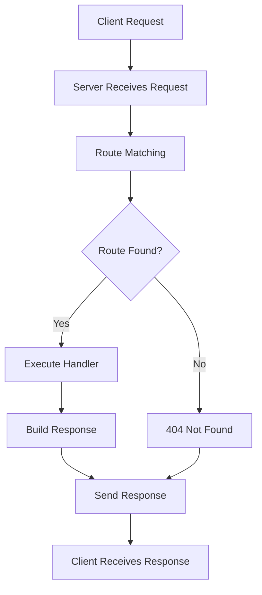

# Basic Concepts

This guide introduces the core concepts of Hypern that you need to understand to build effective applications.

## Overview

Hypern is built on a hybrid architecture combining Python's ease of use with Rust's performance. Understanding these fundamental concepts will help you make the most of the framework.

## Core Components

### 1. Application (Hypern)

The `Hypern` class is the main entry point of your application. It manages routing, configuration, and server lifecycle.

```python
from hypern import Hypern

app = Hypern()
```

**Key Responsibilities:**
- Route registration and management
- Server configuration
- Request handling coordination
- Middleware orchestration

### 2. Request

The `Request` object contains all information about an incoming HTTP request.

```python
def handler(request: Request, response: Response):
    # Access request properties
    path = request.path
    method = request.method
```

**Request Properties:**
- `path` - The URL path of the request
- `method` - HTTP method (GET, POST, etc.)
- `headers` - Request headers
- `body` - Request body data
- `params` - URL parameters
- `query` - Query string parameters

### 3. Response

The `Response` object is a builder for constructing HTTP responses. It uses a fluent API pattern.

```python
def handler(request: Request, response: Response):
    response.status(200)
    response.header("Content-Type", "application/json")
    response.body_str('{"message": "success"}')
    response.finish()
```

**Response Methods:**
- `status(code)` - Set HTTP status code
- `header(key, value)` - Add response header
- `body(bytes)` - Set response body as bytes
- `body_str(text)` - Set response body as string
- `finish()` - Complete and send the response

### 4. Router

The `Router` manages URL routing and maps requests to handlers.

```python
from hypern.hypern import Router, Route

router = Router(path="/api")
```

**Router Features:**
- Path-based routing
- HTTP method matching
- Route parameters
- Route grouping

### 5. Route

A `Route` defines a mapping between a URL pattern and a handler function.

```python
from hypern.hypern import Route

route = Route(
    path="/users",
    function=user_handler,
    method="GET"
)
```

**Route Components:**
- `path` - URL pattern to match
- `function` - Handler function to execute
- `method` - HTTP method to match
- `doc` - Optional documentation string

## Request/Response Lifecycle

Understanding the request/response lifecycle is crucial for building Hypern applications.



### Lifecycle Steps

1. **Request Reception**: Server receives HTTP request
2. **Route Matching**: Router finds matching route
3. **Handler Execution**: Handler function processes request
4. **Response Building**: Handler constructs response
5. **Response Sending**: Server sends response to client

## Routing Patterns

### Simple Routes

Direct path matching:

```python
app.add_route("GET", "/users", users_handler)
app.add_route("POST", "/users", create_user_handler)
```

### Route Parameters

Capture dynamic segments in URLs:

```python
# Route with parameter
app.add_route("GET", "/users/{id}", get_user_handler)

def get_user_handler(request: Request, response: Response):
    # Access path parameter
    user_id = request.path_params.get("id")
    # ... process request
```

### HTTP Methods

Hypern supports all standard HTTP methods:

- **GET** - Retrieve resources
- **POST** - Create new resources
- **PUT** - Update resources (full replacement)
- **PATCH** - Update resources (partial)
- **DELETE** - Remove resources
- **HEAD** - Get headers only
- **OPTIONS** - Get available methods

## Handler Functions

Handler functions are the core of your application logic. They receive requests and build responses.

### Handler Signature

```python
def handler_function(request: Request, response: Response) -> None:
    # Process request
    # Build response
    response.finish()
```

### Handler Best Practices

1. **Always finish responses**: Call `response.finish()`
2. **Set status codes**: Use appropriate HTTP status codes
3. **Handle errors**: Use try-except for error handling
4. **Be specific with headers**: Set Content-Type and other headers
5. **Keep handlers focused**: One responsibility per handler

### Example Handler

```python
def get_user_handler(request: Request, response: Response):
    try:
        user_id = request.path_params.get("id")
        
        # Fetch user data (mock example)
        user = {"id": user_id, "name": "John Doe"}
        
        response.status(200)
        response.header("Content-Type", "application/json")
        response.body_str(json.dumps(user))
    except Exception as e:
        response.status(500)
        response.header("Content-Type", "application/json")
        response.body_str(json.dumps({"error": str(e)}))
    finally:
        response.finish()
```

## Asynchronous Programming

Hypern supports async/await for non-blocking operations.

### Async Handlers

```python
async def async_handler(request: Request, response: Response):
    # Async operations
    data = await fetch_data_async()
    
    response.status(200)
    response.body_str(data)
    response.finish()
```

### When to Use Async

Use async handlers when:
- Making database queries
- Calling external APIs
- Performing I/O operations
- Processing long-running tasks

## Multi-Process Architecture

Hypern uses a multi-process architecture for optimal CPU utilization.

### Workers

Workers are processes that handle incoming requests:

```python
app.start(
    workers=4,  # Number of worker processes
    max_blocking_threads=32
)
```

**Worker Configuration:**
- More workers = better CPU utilization
- Recommended: number of CPU cores
- Each worker handles requests independently

### Blocking Threads

Threads for blocking operations:

```python
app.start(
    max_blocking_threads=32  # For blocking I/O
)
```

## Error Handling

Proper error handling ensures your application is robust and user-friendly.

### HTTP Status Codes

Use appropriate status codes:

- **2xx Success**
  - 200 OK - Request succeeded
  - 201 Created - Resource created
  - 204 No Content - Success with no body

- **4xx Client Errors**
  - 400 Bad Request - Invalid request
  - 401 Unauthorized - Authentication required
  - 403 Forbidden - Access denied
  - 404 Not Found - Resource not found

- **5xx Server Errors**
  - 500 Internal Server Error - Server error
  - 503 Service Unavailable - Server overloaded

### Error Response Pattern

```python
def safe_handler(request: Request, response: Response):
    try:
        # Main logic
        result = process_request(request)
        
        response.status(200)
        response.header("Content-Type", "application/json")
        response.body_str(json.dumps(result))
    except ValueError as e:
        # Client error
        response.status(400)
        response.body_str(json.dumps({"error": str(e)}))
    except Exception as e:
        # Server error
        response.status(500)
        response.body_str(json.dumps({"error": "Internal server error"}))
    finally:
        response.finish()
```

## Configuration

Configure your application through the `start()` method:

```python
app.start(
    host="0.0.0.0",           # Bind address
    port=8000,                 # Port number
    workers=4,                 # Worker processes
    max_blocking_threads=32,   # Blocking threads
    max_connections=10000      # Max concurrent connections
)
```

### Configuration Best Practices

1. **Development**: Use single worker for easier debugging
2. **Production**: Use multiple workers (= CPU cores)
3. **High I/O**: Increase max_blocking_threads
4. **High concurrency**: Increase max_connections

## Performance Characteristics

### Rust Core

Hypern's core is written in Rust, providing:
- **Zero-cost abstractions**
- **Memory safety** without garbage collection
- **Fearless concurrency**
- **Minimal runtime overhead**

### Python Interface

Python layer provides:
- **Familiar syntax**
- **Rich ecosystem**
- **Rapid development**
- **Easy testing**

### Performance Tips

1. **Use multiple workers** for CPU-bound tasks
2. **Use async handlers** for I/O-bound tasks
3. **Keep responses small** for faster transmission
4. **Cache frequently accessed data**
5. **Use binary formats** (msgpack) when possible

## Type Safety

Hypern provides full type hint support:

```python
from hypern import Hypern, Request, Response
from typing import Dict, Any

def typed_handler(request: Request, response: Response) -> None:
    data: Dict[str, Any] = {"key": "value"}
    
    response.status(200)
    response.body_str(json.dumps(data))
    response.finish()
```

**Benefits:**
- IDE autocompletion
- Static type checking with mypy
- Better code documentation
- Fewer runtime errors

## Testing

Test your handlers easily:

```python
import pytest
from hypern import Hypern, Request, Response

def test_handler():
    app = Hypern()
    
    @app.get("/test")
    def handler(request: Request, response: Response):
        response.status(200)
        response.body_str("test")
        response.finish()
    
    # Test logic here
```

## Next Steps

Now that you understand the basic concepts, continue learning:

- [Project Structure](project-structure.md) - Organize your application
- [Routing Guide](../guide/routing.md) - Advanced routing techniques
- [Request Handling](../guide/requests.md) - Working with requests
- [Response Building](../guide/responses.md) - Constructing responses
- [Middleware](../guide/middleware.md) - Adding middleware layers

## Key Takeaways

1. **Hypern** is the main application class
2. **Request** contains incoming data
3. **Response** builds outgoing data
4. **Router** maps URLs to handlers
5. **Handlers** process requests and build responses
6. **Always call** `response.finish()`
7. **Use async** for I/O operations
8. **Handle errors** gracefully
9. **Configure workers** based on workload
10. **Leverage type hints** for better code quality